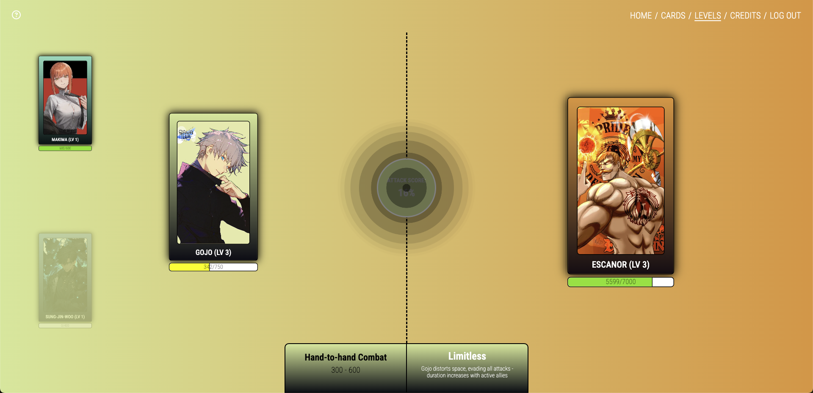

# Anime Showdown

Anime Showdown is a single player level-based anime card game featuring nearly a dozen of the most iconic anime characters each with unique in-game abilities. Fight alongside and against your favorite characters, create a synergistic team, and level up your cards to fight stronger bosses as you progress through levels. 

# [Preview](https://anime-showdown.vercel.app/)

## Built with

- Vite: Optimized developer experience
- React: User interface
- ExpressJS: REST API
- PostgreSQL: CRUD operations
- Tailwind: Extra styling
- Framer Motion: Smooth motion animations

## Pending Features

- **Multiplayer**
- **Additional levels and cards**
- **Easy, medium, difficult mode levels**
- **Text indicating damage numbers**
- **Sound effects**

## Contributing

Contributions are welcome! If you encounter any problems or have any suggestions, please open an issue or submit a pull request.
