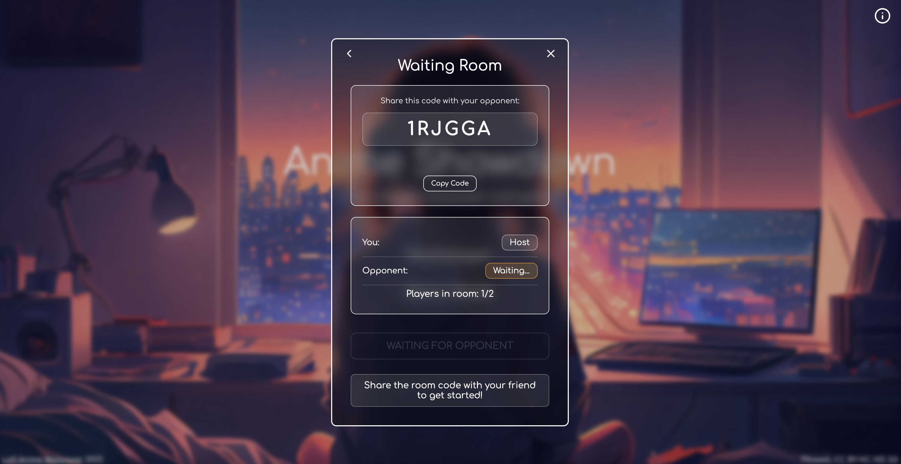
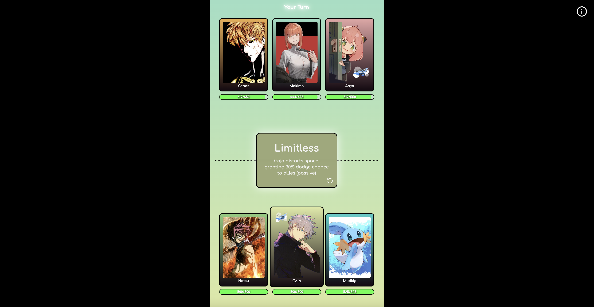
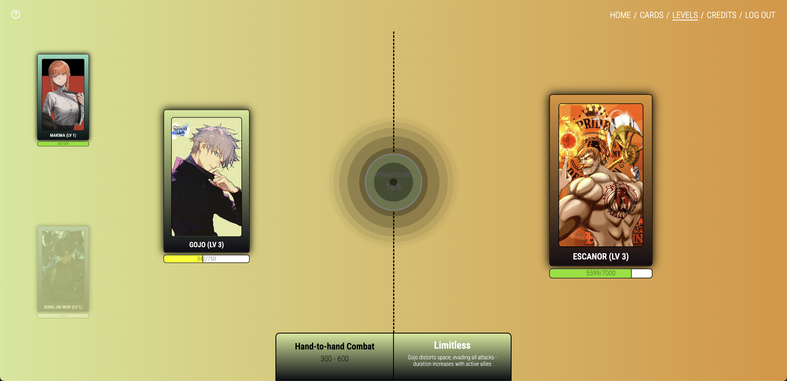

# Anime Showdown

Anime Showdown is a multiplayer turn-based card game featuring characters from some of the most iconic anime series (Naruto, One Piece, Attack on Titan, Pokemon, etc). Characters have unique in-game abilities with various synergies and you create a 3-person team to face off against another player. 

# Multiplayer

# Single Player

Fight stronger bosses and level up your cards as you progress through levels.

## Pending Features

- **Easy, medium, difficult mode levels**
- **Sound effects**

## Contributing

All contributions are welcome! If you encounter any bugs or have any suggestions, please open an issue or submit a pull request.
